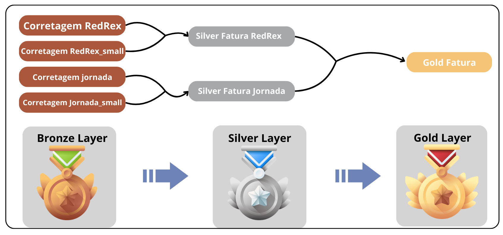

# Projeto de Transformação de PDF para o banco de dados

## Objetivo

O objetivo deste projeto é transformar arquivos PDF de notas de corretagem e transportar os dados para um banco de dados. Para isso, foi utilizado o Python para realizar a extração dos dados dos arquivos PDF e mandar para uma imagem docker do PostgreSQL. Após os dados serem inseridos no banco de dados, foi utilizado o dbt para realizar a transformação dos dados. Criando assim, as camadas de bronze, prata e ouro.

## Tecnologias utilizadas


## Estrutura do projeto

```
Project_pdf_csv
│   README.md
│   docker-compose.yml
│   pyproject.toml
| src
    | dbt
        | dbt_corretagem
            | dbt_project.yml
            | models
                | bronze
                | prata
                | ouro
                | sources.yml
    | config
    | start.py
    | visualizacao_pdf.py

```

## Como rodar o projeto

1. Clone o repositório

```bash
git clone https://github.com/saulo-duarte/Transformador-PDF-para-BD.git
```

2. Entre na pasta do projeto

```bash
cd Transformador-PDF-para-BD
```

3. Instale as dependências

```bash

pip install -r requirements.txt

```
4. instale o docker
    
```bash
# Windows
https://docs.docker.com/docker-for-windows/install/

# Linux
sudo apt-get update
sudo apt-get install docker-ce docker-ce-cli containerd.io
```
5. Suba o container do banco de dados

```bash
docker-compose up -d
```
6. Execute o arquivo start.py

```bash
python src/start.py
```
7. Execute o dbt

```bash
cd src/dbt/
dbt run
```
## Pipeline Completa


## Fluxo de dados

