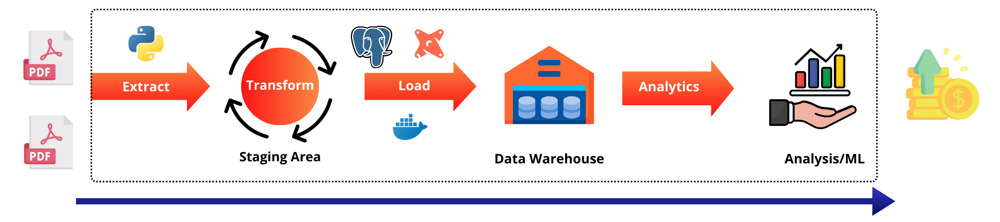
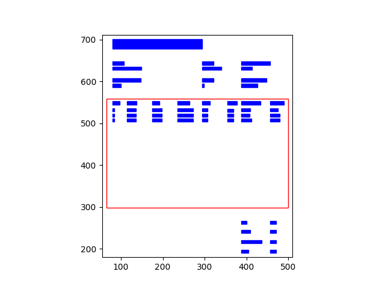
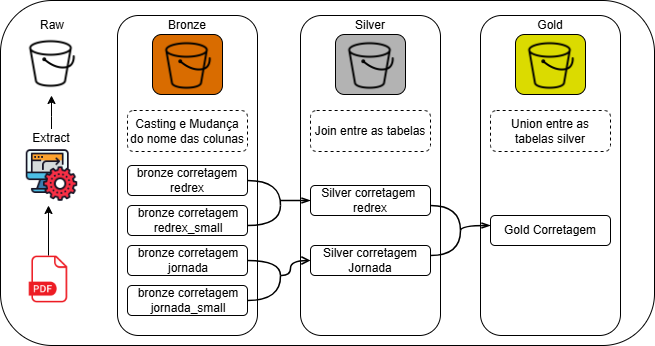

# Extração de dados de PDF para o banco de dados

## Objetivo

O objetivo deste projeto é transformar arquivos PDF de notas de corretagem e transportar os dados para um banco de dados. Para isso, foi utilizado o Python para realizar a extração dos dados dos arquivos PDF e mandar para uma imagem docker do PostgreSQL. Após os dados serem inseridos no banco de dados, foi utilizado o dbt para realizar a transformação dos dados. Criando assim, as camadas de bronze, prata e ouro.

## Indice

- [Tecnologias utilizadas](#tecnologias-utilizadas)
- [Estrutura do projeto](#estrutura-do-projeto)
- [Pipeline Completa](#pipeline-completa)
- [Funcionamento](#funcionamento)
- [Fluxo dos dados](#fluxo-dos-dados)
- [Como rodar o projeto](#como-rodar-o-projeto)
- [Considerações finais](#considerações-finais)


## Tecnologias utilizadas


## Estrutura do projeto

```
Project_pdf_csv
│   README.md
│   docker-compose.yml
│   pyproject.toml
| src
    | dbt
        | dbt_corretagem
            | dbt_project.yml
            | models
                | bronze
                | prata
                | ouro
                | sources.yml
    | config
    | start.py
    | visualizacao_pdf.py

```
## Pipeline Completa




## Funcionamento

1. Primeiramente, o arquivo visualizacao_pdf.py foi utilizado para visualizar o arquivo PDF e entender como os dados estavam estruturados, utilizando a biblioteca camelot para extrair os dados do PDF em conjunto com a matplotlib para visualização dos dados.



2. Após a visualização dos dados, foi criado o diretório src/config, onde foi criado o arquivo config.py, que contém as informações de conexão com o banco de dados.

3. Dentro do diretório config, foi criado o diretorio rules, onde foi criado o arquivo regras.py, que contém as regras de extração dos dados do PDF de acordo com a estrutura do arquivo.

4. O arquivo start.py foi criado para realizar a extração dos dados, utilizando regras.py e as configurações do arquivo postgres.py para se conectar ao banco de dados.

5. Após a extração dos dados, foi criado o diretório dbt, onde foi criado o diretório dbt_corretagem, que contém o arquivo dbt_project.yml, que contém as configurações do projeto dbt, e o diretório models, que contém os diretórios bronze, prata e ouro, que contém os arquivos sql que realizam a transformação dos dados.

6. Na camada bronze são feitas transformações básicas nos dados, como a conversão de tipos de dados e substituição de , por . nos valores decimais.

7. Na camada prata são feitas transformações mais complexas, como a criação de novas colunas e a junção de tabelas.

8. Na camada ouro todos os dados são tratados e KPIs são criados. Deixando os dados prontos para serem consumidos.

## Fluxo dos dados

## Como rodar o projeto

1. Clone o repositório

```bash
git clone https://github.com/saulo-duarte/Transformador-PDF-para-BD.git
```

2. Entre na pasta do projeto

```bash
cd Transformador-PDF-para-BD
```

3. Instale as dependências

```bash

pip install -r requirements.txt

```
4. instale o docker
    
```bash
# Windows
https://docs.docker.com/docker-for-windows/install/

# Linux
sudo apt-get update
sudo apt-get install docker-ce docker-ce-cli containerd.io
```
5. Suba o container do banco de dados

```bash
docker-compose up -d
```
6. Execute o arquivo start.py

```bash
python src/start.py
```
7. Execute o dbt

```bash
cd src/dbt/
dbt run
```


## Considerações finais

O projeto foi feito com o intuito de aprender mais sobre a ferramenta dbt e como ela pode ser utilizada para realizar a transformação dos dados. O projeto foi feito de forma simples, mas pode ser expandido para atender a necessidade de cada usuário.

### Melhorias futuras

- Serviços de **nuvem para armazenamento dos dados**. Gerando assim, mais segurança e escalabilidade. Utilizando **triggers, filas e mensageria** para automatizar o processo.

- **Ferramentas de orquestração** de pipelines, como o Apache Airflow, para automatizar a execução dos scripts.

- Utilização de **ferramentas de monitoramento**, como o Grafana, para monitorar o desempenho do banco de dados.

- **Terraform para criar a infraestrutura** necessária para o projeto, podendo assim, criar e destruir a infraestrutura de forma rápida e segura. Além de permitir a reutilização do código e versionamento da infraestrutura.
